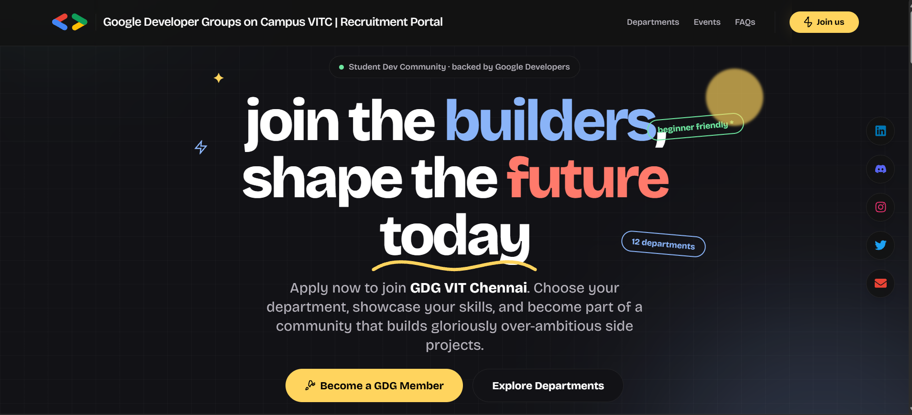
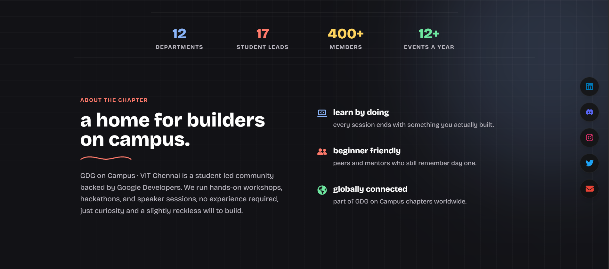
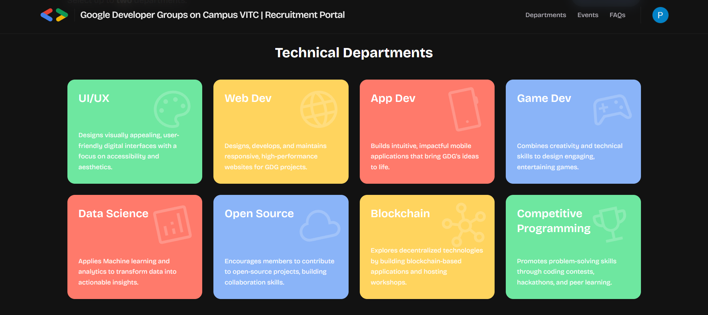
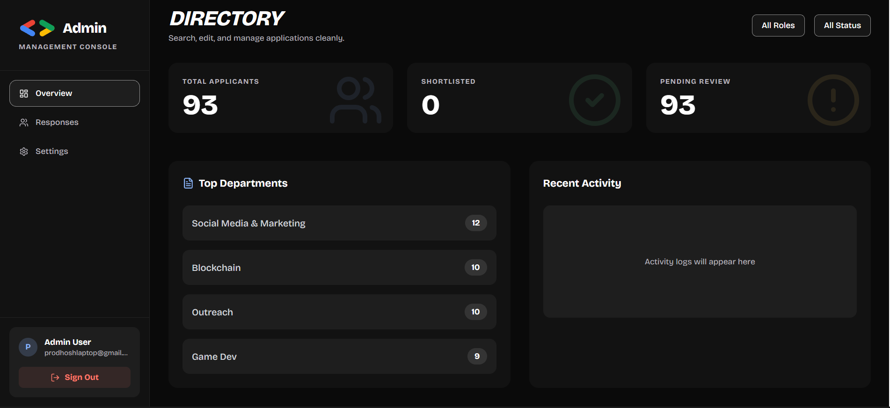
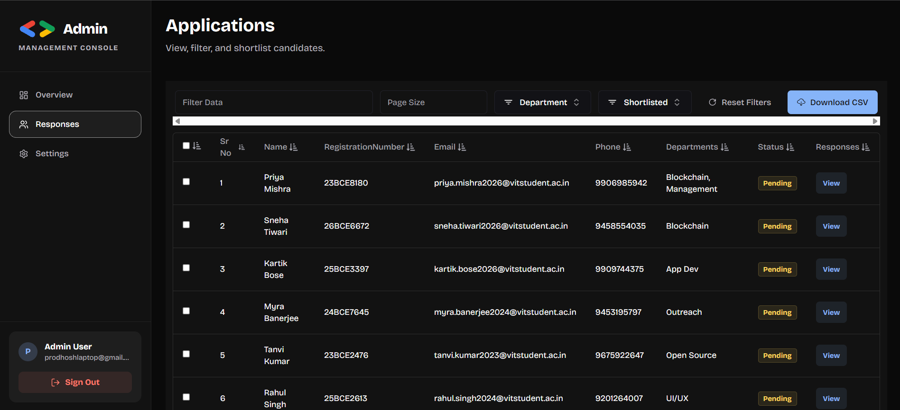

# GDG Recruitment Portal

Hey there! Welcome to the official **GDG Web Dev Recruitment Portal**. 

**Live Demo:** [https://gdg-webdev.vercel.app/](https://gdg-webdev.vercel.app/)

This is the central hub where we handle onboarding, showcase our departments, and manage everything recruitment-related. We've built this with developer experience and a snappy user interface in mind. Let's dive in!

## Visual Showcase

Here’s a quick peek into what the recruitment portal actually looks like. We’ve poured our hearts into making sure the experience is just as good as the tech behind it.

Right off the bat, the landing page hits you with a modern, dark-themed hero section. The floating informational badges, dynamic SVG squiggles, and beautiful typography set a deeply interactive and polished first impression.

Scroll down a bit and you'll find the about section. We kept it clean and readable, laying out what the community is all about while continuing that sleek glassmorphism aesthetic.

The departments section is where students decide their path. We've structured this as an engaging grid, clearly separating the technical and non-technical tracks. The hover effects here really make the options pop!

For the people running the show, the admin dashboard is the command center. This data table is fully equipped with advanced global filtering, department-specific sorting, and a snappy interface to process applicants effortlessly.

Managing who has access is just as important. The admin users view gives a straightforward look at who holds the keys to the castle, ensuring everything stays secure.

## The Tech Stack

We're riding the bleeding edge of web development. Here's what makes this app tick:

*   **Next.js 14 (App Router):** The backbone of our app. Fast, SEO-friendly, and a joy to write.
*   **Tailwind CSS:** For that beautiful, utility-first styling without ever leaving our HTML.
*   **Better Auth:** Handling authentication securely and seamlessly (hooked up to Firestore!).
*   **Firebase / Firestore:** Our trusted NoSQL database for lighting-fast data sync and storage.
*   **Radix UI & Shadcn vibes:** Accessible, unstyled primitives wrapped in our own custom design system.
*   **Framer Motion & GSAP:** Bringing the UI to life with butter-smooth animations.
*   **Tiptap Editor:** A powerful rich-text editor for all our text input needs.
*   **Zod + React Hook Form:** Making form validation a breeze.

## Features & How to Control Them

The portal is broken down into a few key areas, all of which you can navigate through the app router:

1.  **Admin Dashboard (`/admin`):**
    *   *The Command Center.* This is where you control *everything*. 
    *   You can view applications, manage user roles, review candidate submissions, and update the state of the recruitment drive. 
    *   **To access:** Make sure your user account has the appropriate admin flags in Firestore, then head over to `/admin`.
2.  **Join Flow (`/join`):**
    *   The smooth, interactive onboarding flow for potential recruits. This is the front-facing application experience.
3.  **Departments (`/departments`):**
    *   Information hubs detailing what each part of our team does.
4.  **Development Area (`/development`):**
    *   A space dedicated to internal dev resources or staging features.

## AI & SEO Friendly

We care about visibility and AI integrations! We've included some standard files to help bots and LLMs understand our app:

*   **`sitemap.xml`**: Helps search engines index our core pages efficiently.
*   **`robots.txt`**: Guides web crawlers on what to index (and keeps them out of the `/admin` area!).
*   **`llms.txt` & `llms-full.txt`**: Markdown-formatted guides specifically designed to provide context to Large Language Models (like ChatGPT or Claude) if they ever need to parse our codebase or site architecture.

## Getting Started Locally

Want to spin this up on your machine? It's super easy:

1. Clone the repo.
2. Make sure you have your environment variables set up (check `.env.example`). You'll need Firebase credentials and a Better Auth secret.
3. Run `npm install` (or your preferred package manager).
4. Run `npm run dev`.
5. Open `http://localhost:3000` and enjoy!

---

  <h3>Built with love & coffee by <b>Prodhosh VS</b></h3>
  

    <a href="https://prodhosh.me"><b>prodhosh.me</b></a> &nbsp;&bull;&nbsp;
    <a href="https://github.com/prodhosh"><b>github.com/prodhosh</b></a> &nbsp;&bull;&nbsp;
    <a href="https://linkedin.com/in/prodhoshvs"><b>in/prodhoshvs</b></a>
  

  
<i>"Crafting pixel-perfect experiences, one line of code at a time!"</i>

